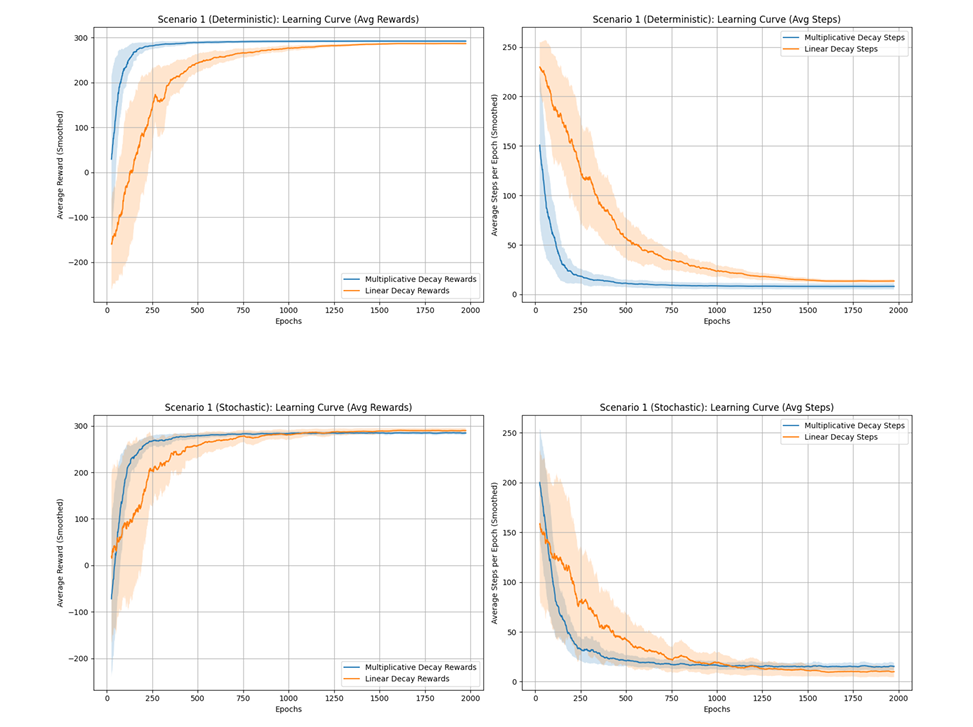
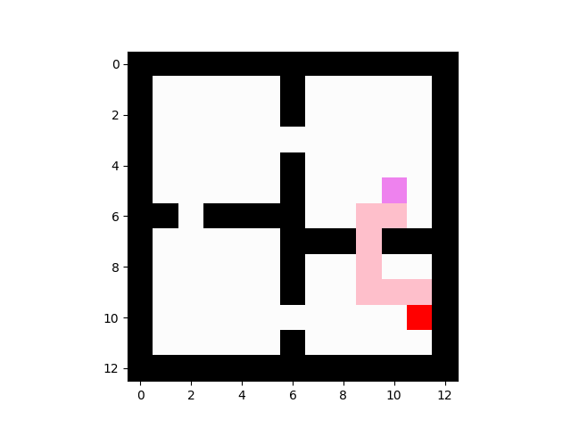

# Reinforcement Learning Agent for Grid-World Navigation

Implementation of a Q-learning agent in Python to solve a series of increasingly complex package-collection tasks in the "Four-Rooms" grid-world environment. This project focuses on the core principles of Reinforcement Learning, including reward function design, policy optimization, and the exploration-exploitation trade-off.

The agent was successfully trained to find optimal paths in both deterministic and stochastic environments, handling challenges like multiple unordered and ordered package pickups.

### Performance Analysis (Scenario 1: Stochastic)

*This plot shows the agent's learning progress over 2,000 epochs in a stochastic environment. It compares average rewards and steps-per-epoch for two different epsilon-decay strategies, demonstrating a successful convergence to an effective policy.*

paths:



---

### Key Concepts & Technologies:
*   **Core Libraries:** **Python, NumPy, Matplotlib**
*   **Core Algorithm:** Implemented the **Q-Learning** algorithm from the ground up to learn the optimal action-selection policy.
*   **Reinforcement Learning Concepts:**
    *   **Reward Function Design:** Developed custom reward signals to guide the agent's behavior for different task objectives (e.g., negative rewards for wrong moves, positive rewards for finding packages).
    *   **Exploration vs. Exploitation:** Implemented and compared multiple Epsilon-Greedy strategies (linear vs. multiplicative decay) to balance discovering the environment with exploiting known good paths.
    *   **Hyperparameter Tuning:** Systematically experimented with learning rates (alpha) and discount factors (gamma) to achieve stable and efficient learning.
    *   **Stochastic Environments:** Successfully trained the agent to derive a robust policy even when its actions had a probabilistic (random) outcome.

---

### Scenarios Implemented:
*   **Scenario 1:** Simple Package Collection (1 package, deterministic & stochastic)
*   **Scenario 2:** Multiple Package Collection (4 unordered packages)
*   **Scenario 3:** Ordered Multiple Package Collection (3 packages in a specific R-G-B order)

---

### How to Run:
*This project is structured in separate scripts for each scenario.*

1.  **Prerequisites:** Requires Python with NumPy and Matplotlib.
    ```bash
    pip install numpy matplotlib
    ```
2.  **Run a scenario:**
    ```bash
    python Scenario1.py
    ```
    *The script will run the simulation and display a Matplotlib window showing the final path taken by the trained agent.*